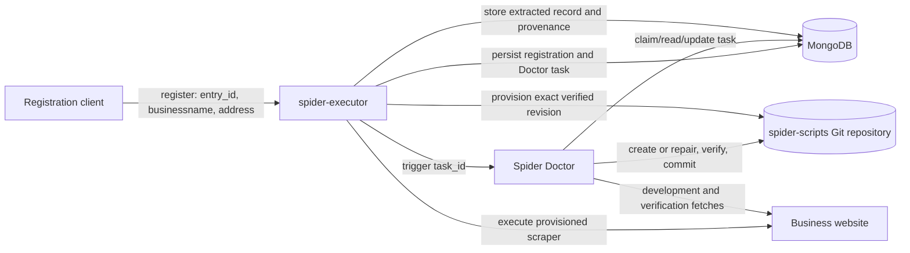
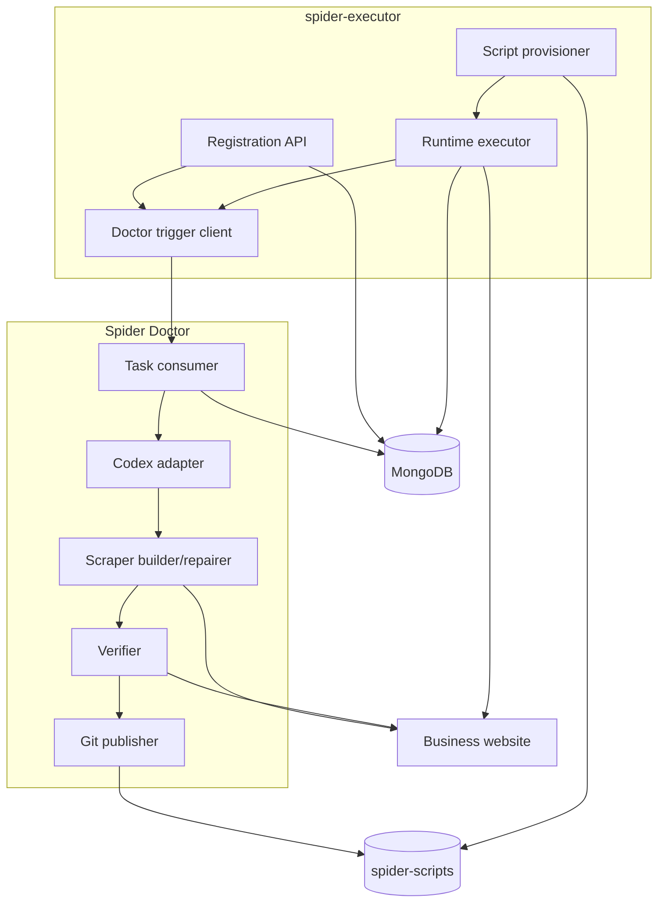
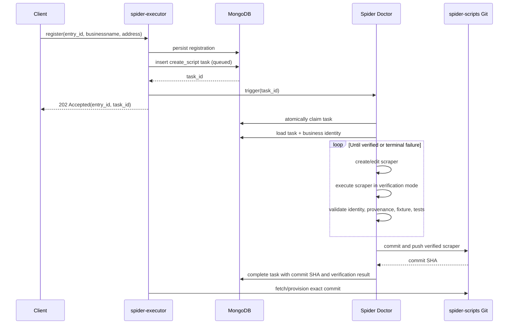
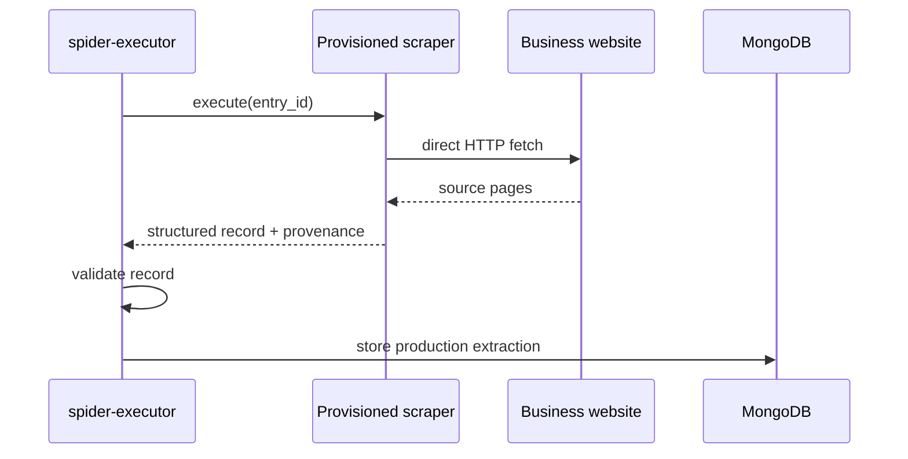
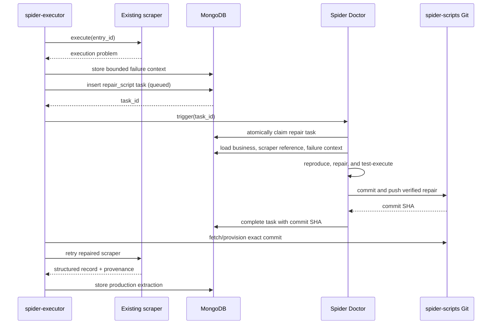
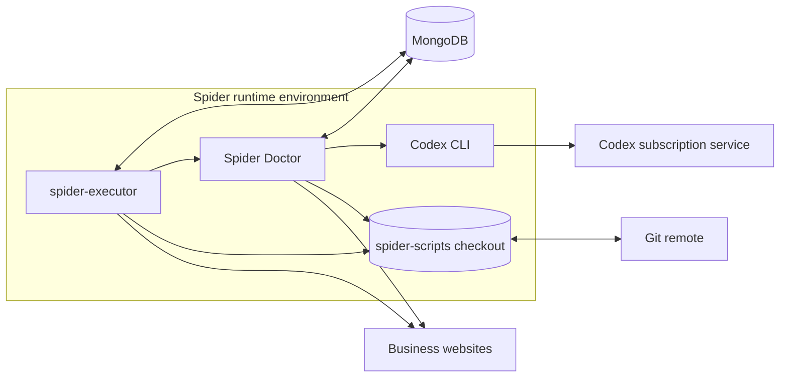

# Spider Platform Architecture

> Architecture documentation following the [arc42](https://arc42.org/) template.
>
> **Status:** Target architecture for `spider-executor`, Spider Doctor, `spider-scripts`, and MongoDB.

## 1. Introduction and Goals

### 1.1 Requirements overview

The Spider Platform turns a registered business into repeatable, deterministic web extraction:

- `spider-executor` exposes an asynchronous `register` operation accepting:
  - `entry_id`
  - `businessname`
  - `address`
- Registration creates a durable script-creation task in MongoDB and triggers Spider Doctor.
- Spider Doctor creates the deterministic scraper, executes it while developing it, verifies it, and commits it to `spider-scripts`.
- After the scraper is provisioned, `spider-executor` executes it during normal operation and stores extracted records in MongoDB.
- Spider Doctor is invoked again only when the executor encounters an execution problem. Repair tasks are also persisted in MongoDB before Doctor is triggered.
- `entry_id` is the stable identity across registration, tasks, scraper association, execution, and stored results. A slug is not part of the contract.
- MongoDB is the authoritative store for extracted data and Doctor tasks.

The central architectural principle remains the compiler/runtime split:

| Responsibility | Component | When used |
|---|---|---|
| Create or repair deterministic scraper code | Spider Doctor using Codex | On registration and execution failure only |
| Execute a provisioned deterministic scraper | `spider-executor` | During normal operation |
| Persist tasks, status, business registration, and extracted data | MongoDB | Throughout the lifecycle |

### 1.2 Quality goals

| Priority | Quality goal | Meaning |
|---:|---|---|
| 1 | Data integrity | Extract only data supported by the business's verified website; missing fields remain `null`; every value has provenance. |
| 2 | Durability | Registration and repair requests survive process restarts because tasks are stored in MongoDB before Doctor is triggered. |
| 3 | Determinism | Provisioned scrapers run without an LLM during normal execution. |
| 4 | Recoverability | Failed Doctor or executor work remains visible and retryable from persisted task state. |
| 5 | Isolation | Doctor may change scraper code but must not control production data writes or general infrastructure. |
| 6 | Traceability | Every created or repaired scraper is linked to an `entry_id`, Doctor task, verification result, and Git commit. |

### 1.3 Stakeholders

| Stakeholder | Concern |
|---|---|
| Platform operator | Reliable asynchronous registration, visible task state, and safe recovery. |
| `spider-executor` maintainer | Stable registration contract and deterministic runtime behavior. |
| Spider Doctor maintainer | Sufficient context and controlled write access to create and repair scripts. |
| Data consumer | Accurate MongoDB records with field-level provenance. |
| Repository maintainer | Reviewed, reproducible, and attributable scraper changes. |

## 2. Architecture Constraints

1. Stock Hermes Agent must remain unchanged; no custom Hermes build is part of this architecture.
2. Doctor uses the existing Codex subscription through a standalone integration, not a metered API key and not a general-purpose LLM proxy.
3. `register` is asynchronous and must not wait for scraper creation, verification, Git operations, or provisioning.
4. Doctor is used only:
   - during registration to create a scraper; or
   - after an executor execution problem to repair a scraper.
5. MongoDB is the durable source of Doctor task state.
6. Executor must persist a task before triggering Doctor.
7. Doctor retrieves the authoritative `entry_id`, `businessname`, `address`, operation, and failure context from MongoDB; the trigger is only a wake-up/reference mechanism.
8. Doctor executes a scraper while creating or repairing it, but Doctor's development output is temporary and is not production data.
9. Executor alone performs normal production execution and stores extracted records in MongoDB.
10. Doctor may write, commit, and push verified changes to `spider-scripts`.
11. A slug is not required. Script identity and lookup are based on `entry_id`.
12. Scrapers use direct HTTP fetching with realistic browser headers; no headless browser is part of the normal scraper runtime.

## 3. Context and Scope

### 3.1 Business context



### 3.2 External interfaces

| Interface | Direction | Purpose |
|---|---|---|
| Registration API | Client → executor | Asynchronously register `entry_id`, `businessname`, and `address`. |
| Doctor trigger | Executor → Doctor | Wake Doctor for a task already persisted in MongoDB. Carries a task reference, not authoritative business content. |
| MongoDB task access | Executor/Doctor ↔ MongoDB | Persist, claim, inspect, and update creation/repair tasks. |
| Git | Doctor → `spider-scripts` | Commit and push verified scraper creation or repair. |
| Script provisioning | Executor ← `spider-scripts` | Fetch and activate the exact verified commit. |
| Website HTTP | Doctor/executor → business website | Doctor verifies during development; executor extracts during production. |
| MongoDB result storage | Executor → MongoDB | Persist production extraction records and provenance. |

### 3.3 Out of scope

- A general-purpose OpenAI-compatible subscription proxy.
- A custom or forked Hermes Agent.
- LLM-based extraction during normal scraper execution.
- Doctor scheduling unrelated to registration or execution failure.
- Doctor writing production extraction records.
- Any file-based output repository as a data store.
- Slug generation as part of the public or internal contract.

## 4. Solution Strategy

1. **Persist before triggering:** Executor writes a Doctor task to MongoDB before sending the trigger. MongoDB, not the trigger transport, is authoritative.
2. **Asynchronous registration:** Executor returns acceptance as soon as registration and task persistence succeed.
3. **Narrow Doctor lifecycle:** Doctor handles script birth and script failure only.
4. **Entry-ID identity:** `entry_id` connects business registration, Doctor tasks, scraper lookup, Git history, execution, and MongoDB records.
5. **Development versus production execution:** Doctor runs scripts to prove them; executor runs provisioned scripts to produce production records.
6. **Git as the code provisioning boundary:** Doctor commits/pushes verified code; executor activates a specific commit rather than an uncommitted working tree.
7. **Fail-closed verification:** Doctor does not provision or commit a scraper that fails identity, provenance, live-run, fixture, path-scope, or test checks.
8. **Token-free runtime:** Codex is absent from successful normal execution.

## 5. Building Block View

### 5.1 Level 1



### 5.2 `spider-executor`

#### Registration API

- Accepts `entry_id`, `businessname`, and `address`.
- Validates required fields and the caller's authorization.
- Stores the registration and a `create_script` task in MongoDB.
- Triggers Doctor only after successful persistence.
- Returns an asynchronous acceptance response containing at least `entry_id` and `task_id`.

A representative response is:

```http
HTTP/1.1 202 Accepted
Content-Type: application/json

{
  "entry_id": "business-123",
  "task_id": "doctor-task-456",
  "status": "queued",
  "operation": "create_script"
}
```

The exact endpoint path and status-query API remain implementation decisions.

#### Runtime executor

- Resolves the provisioned scraper using `entry_id`.
- Executes the deterministic scraper.
- Validates the returned record.
- Stores successful production output and provenance in MongoDB.
- On an execution problem, stores failure context and a `repair_script` task before triggering Doctor.
- Does not invoke Doctor for successful runs.

#### Doctor trigger client

- Sends a task reference after the task is durable in MongoDB.
- Does not make the trigger payload authoritative.
- A lost trigger must not destroy the task; persisted queued tasks remain recoverable.

#### Script provisioner

- Fetches the commit reported by a successful Doctor task.
- Activates exactly that revision for executor use.
- Does not execute an uncommitted or partially written scraper.

### 5.3 Spider Doctor

#### Task consumer

- Receives or discovers a Mongo-backed task reference.
- Atomically claims eligible work so the same task is not processed concurrently.
- Loads authoritative task and business information from MongoDB.
- Updates task progress and terminal status.

#### Codex adapter

- Invokes the official Codex CLI using a dedicated subscription login.
- Supplies fixed project instructions and task context.
- Does not expose a general prompt API.

#### Scraper builder/repairer

- For `create_script`, creates the scraper associated with `entry_id`.
- For `repair_script`, loads the existing scraper and recorded execution problem, reproduces the failure, and repairs it.
- Executes the scraper iteratively in a development/verification context.
- Writes only approved scraper, metadata, fixture, and test paths.

#### Verifier

Before publication, verifies:

- The website belongs to the registered business.
- The website address matches the registered address sufficiently to establish identity.
- Extracted fields come from the verified website.
- Missing fields are `null`, never inferred or fabricated.
- Every non-null field has exact source provenance.
- Live execution succeeds.
- Offline fixture verification succeeds.
- The canonical test suite passes.
- Changed files remain within the task's permitted scope.
- No secrets, symlinks, unrelated scraper changes, or framework modifications are included.

#### Git publisher

- Stages only files authorized for the current `entry_id`.
- Commits a verified creation or repair.
- Pushes to the authoritative `spider-scripts` repository.
- Records the resulting commit SHA in the MongoDB task.
- Must not publish if verification fails.

### 5.4 MongoDB

MongoDB stores at least:

- Business registration (`entry_id`, `businessname`, `address`).
- Doctor creation and repair tasks.
- Executor failure context needed for repair.
- Doctor progress, verification summary, and resulting Git commit.
- Production extraction results written by executor.

A conceptual Doctor task is:

```json
{
  "_id": "doctor-task-456",
  "entry_id": "business-123",
  "operation": "create_script",
  "status": "queued",
  "attempt": 0,
  "created_at": "2026-08-19T12:00:00Z",
  "started_at": null,
  "completed_at": null,
  "failure_context": null,
  "result": null
}
```

A repair task uses `"operation": "repair_script"` and includes sanitized, bounded failure context. Exact collection names and schemas remain implementation details.

### 5.5 `spider-scripts`

- Authoritative source for deterministic scraper code and verification fixtures/tests.
- Written by Doctor after successful verification.
- Read/provisioned by executor.
- Script association is based on `entry_id`; a slug is not required by the target architecture.

## 6. Runtime View

### 6.1 Asynchronous registration and script creation



Registration success means the task was accepted durably; it does not mean the scraper is already ready.

### 6.2 Normal execution



Doctor is not involved in this path.

### 6.3 Execution problem and repair



### 6.4 Failure behavior

- If registration persistence fails, executor must not trigger Doctor and must not return acceptance.
- If triggering Doctor fails after persistence, the MongoDB task remains queued and recoverable.
- If Doctor fails, the task becomes explicitly failed or remains retryable according to policy; no partial scraper is provisioned.
- If verification fails, Doctor does not commit/push.
- If Git publication fails, the task is not marked completed.
- If executor provisioning fails, the verified commit remains recorded for retry.
- If the repaired scraper fails again, executor records the new failure and applies bounded retry/deduplication policy rather than creating an unbounded repair loop.

## 7. Deployment View

### 7.1 Logical deployment



The exact choice between containers and host services is not fixed by this document. The security boundaries must remain the same:

- Executor has production MongoDB result-write capability and read/provision access to scraper code.
- Doctor has task access and Git write capability, but should not receive broad production data-write privileges.
- Codex authentication is dedicated to Doctor and persisted separately from Hermes.
- Executor must not expose Doctor as a general LLM endpoint.
- Management interfaces should remain loopback-only or on a restricted internal network.
- The Docker socket must not be mounted into Doctor.

### 7.2 Filesystem and Git

Doctor may work in a controlled Git checkout or task-specific worktree. Publication must be atomic from executor's perspective:

1. Doctor edits and test-executes without exposing partial code to executor.
2. Doctor verifies the complete change.
3. Doctor commits and pushes.
4. Doctor records the exact commit SHA.
5. Executor fetches and activates that commit.

If Doctor and executor share a filesystem, executor must still activate only committed revisions and must not load files while Doctor is editing them.

## 8. Cross-Cutting Concepts

### 8.1 Task durability and idempotency

- Task creation and registration persistence should be atomic where practical.
- Active create/repair tasks should be deduplicated per `entry_id` and operation.
- Task claims must be atomic.
- Retries increment an attempt counter and preserve previous error information.
- Terminal success records the exact Git commit and verification summary.

A minimal state model is:

```text
queued → running → succeeded
              └→ failed
```

A lease/heartbeat may be added so abandoned `running` tasks can safely return to `queued`. Exact retry limits and lease durations are operational configuration, not hard-coded architecture values.

### 8.2 Security

- Authenticate registration and Doctor-trigger interfaces.
- Treat all registered names, addresses, website content, failure messages, and repository files as untrusted data when constructing Codex instructions.
- Bound task and failure-context sizes.
- Never place OAuth tokens, database credentials, or Git credentials in prompts, logs, commits, fixtures, or MongoDB task results.
- Doctor's Git credential should be limited to the `spider-scripts` repository.
- Executor's Git credential should be read-only.
- Restrict Doctor changes by path and reject symlinks or unrelated modifications.
- Do not give Doctor Docker socket, infrastructure administration, or general shell-service access beyond the controlled build environment.

### 8.3 Data integrity and provenance

- Business identity is defined by `entry_id`, `businessname`, and `address` from the persisted registration.
- Discovery sources may locate a website, but extracted values must originate from the verified business website.
- Address verification precedes trust in a candidate domain.
- Each extracted field carries its exact source URL.
- Missing data is represented as `null` with null provenance.
- Doctor may use an LLM to create code, never to invent runtime record values.

### 8.4 Observability

Every Doctor task should expose:

- Task ID and entry ID.
- Operation (`create_script` or `repair_script`).
- Current status and attempt.
- Creation/start/completion timestamps.
- Sanitized terminal error, if failed.
- Verification summary.
- Resulting Git commit, if succeeded.

Logs should correlate by `task_id` and `entry_id` while excluding secrets and full page contents.

### 8.5 Concurrency

- Only one active creation or repair may modify a given entry's scraper at a time.
- Git publication must serialize conflicting repository updates and handle non-fast-forward pushes safely.
- Executor must not run a partially provisioned revision.
- The initial canary should use a single Doctor execution slot.

### 8.6 Testing

Doctor must run both:

1. A live verification execution against the current business website.
2. Offline fixture-based tests plus the repository's canonical test suite.

Production records from Doctor's test executions are discarded. Only executor writes production extraction results to MongoDB.

## 9. Architecture Decisions

### ADR-001: MongoDB is the durable Doctor task source

**Decision:** Persist creation and repair tasks in MongoDB before triggering Doctor.

**Rationale:** Registration is asynchronous, repair work must survive process/trigger failures, and both executor and Doctor already need shared durable state.

**Consequence:** Trigger delivery is a wake-up mechanism; Doctor always loads authoritative task data from MongoDB.

### ADR-002: Doctor is limited to script birth and script failure

**Decision:** Invoke Doctor only for registration-time creation and executor-detected execution repair.

**Rationale:** Normal execution must remain deterministic, cheap, and independent of an LLM.

**Consequence:** Successful executor runs never involve Doctor or Codex.

### ADR-003: Doctor commits and pushes verified scraper code

**Decision:** Doctor owns writing, testing, committing, and pushing created/repaired scraper code.

**Rationale:** Doctor is the component making the code change and has the verification context needed to publish it atomically.

**Consequence:** Doctor requires constrained Git write credentials; executor needs only read/provision access.

### ADR-004: Executor owns production execution and MongoDB result writes

**Decision:** Doctor's executions are development verification only. Executor executes provisioned code and stores production data.

**Rationale:** Separates code generation from production data processing and preserves a deterministic runtime.

### ADR-005: `entry_id` replaces slug as system identity

**Decision:** Use `entry_id` for registration, tasks, scraper association, and result correlation. Do not require a slug.

**Rationale:** The executor already receives a stable entry identifier; deriving another identity adds unnecessary mapping and ambiguity.

### ADR-006: No custom Hermes and no general subscription proxy

**Decision:** Integrate Doctor with the official Codex CLI as a standalone component using subscription authentication.

**Rationale:** The system needs one constrained code-generation operation, not a broadly exposed inference service or a forked agent runtime.

### ADR-007: MongoDB is the single data store

**Decision:** Store production extraction data and Doctor task state in MongoDB; do not maintain a separate file-based output repository (the former one has been deleted).

**Rationale:** MongoDB is the production data store, and a second output repository creates duplication and synchronization risk.

## 10. Quality Requirements

### 10.1 Quality scenarios

| ID | Scenario | Expected response |
|---|---|---|
| Q1 | A client registers a valid entry while Codex work takes several minutes. | Executor persists the task and returns asynchronous acceptance without waiting. |
| Q2 | Executor crashes after storing a task but before Doctor receives the trigger. | The queued task remains in MongoDB and can be retriggered/recovered without re-registering. |
| Q3 | Doctor generates a scraper for the wrong similarly named business. | Address/business verification fails; no commit is published. |
| Q4 | Codex modifies an unrelated scraper or framework file. | Path-scope verification fails; no commit is published. |
| Q5 | A provisioned scraper breaks after a website redesign. | Executor stores a repair task, triggers Doctor, provisions the verified repair, and retries. |
| Q6 | Normal execution succeeds. | Executor stores the record in MongoDB; Doctor and Codex are not invoked. |
| Q7 | Doctor test execution produces extracted data. | Data is used only for verification and is not written as a production MongoDB record. |
| Q8 | Git push succeeds but executor is temporarily unavailable. | Task retains the exact commit SHA; provisioning can resume later. |
| Q9 | Two repair triggers occur for the same entry and failure. | The system deduplicates or serializes them so only one Doctor change is published. |
| Q10 | A field is absent from the verified website. | Scraper returns `null` with null provenance rather than an inferred value. |

## 11. Risks and Technical Debt

| Risk / debt | Impact | Mitigation or next decision |
|---|---|---|
| Current repository conventions are slug-oriented. | Target `entry_id` identity may not match existing paths and runner arguments. | Define and implement the entry-ID-to-script layout and migration before executor integration. |
| Concurrent Doctor Git pushes can conflict. | A verified change may fail publication or overwrite assumptions. | Serialize publication or use task branches with controlled integration. |
| Trigger transport is not yet specified. | Recovery and authentication details remain open. | Choose a narrow internal mechanism; keep MongoDB authoritative regardless of transport. |
| MongoDB collection schemas and indexes are not finalized. | Duplicate active tasks or slow claims are possible. | Define unique/partial indexes and atomic claim operations during detailed design. |
| Codex CLI automation and subscription session renewal need operational validation. | Doctor could stop creating/repairing scripts after auth expiry. | Run a restricted canary and add explicit auth-health reporting. |
| Doctor can write code used in production. | Defective or malicious changes could affect executor. | Enforce path allowlists, tests, exact-commit provisioning, constrained credentials, and auditable task results. |
| Repair loops could become unbounded. | Repeated failures consume resources and generate noisy commits. | Deduplicate failures and define bounded attempts plus terminal human-review state. |

## 12. Glossary

| Term | Definition |
|---|---|
| `entry_id` | Stable identifier supplied to executor registration and used throughout tasks, scraper association, execution, and MongoDB records. |
| Registration | Asynchronous executor operation that accepts `entry_id`, `businessname`, and `address`, persists them, and creates a Doctor creation task. |
| Spider Doctor | LLM-assisted compiler that creates a scraper during registration or repairs it after an execution problem. |
| `spider-executor` | Runtime service that registers entries, triggers Doctor tasks, provisions committed scripts, executes them, and stores production results. |
| Doctor task | Durable MongoDB record representing `create_script` or `repair_script` work. |
| Trigger | Executor-to-Doctor wake-up carrying a task reference; not the authoritative task payload. |
| Provisioning | Fetching and activating the exact verified Git commit for executor use. |
| Verification execution | Doctor-run scraper execution used to develop and validate code; it does not write production data. |
| Production execution | Executor-run scraper execution whose validated result is stored in MongoDB. |
| `spider-scripts` | Authoritative Git repository and runtime source for deterministic scraper code. |
| Provenance | Exact source URL supporting an extracted field value. |
